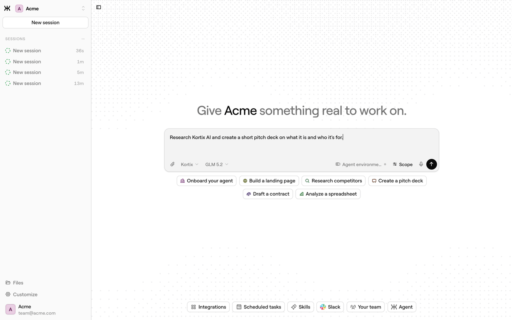

<div align="center">


# Kortix

**The open-source AI Management System**

**The leading open-source alternative to Claude Cowork and ChatGPT Work.**

[](https://github.com/kortix-ai/suna/stargazers)
[](https://github.com/kortix-ai/suna/releases/latest)
[](https://kortix.com/docs)
[](#contributing)

[Website](https://kortix.com) · [Documentation](https://kortix.com/docs) · [Cloud](https://kortix.com) · [Manifesto](MANIFESTO.md)

<br />



</div>

---

Agents that deliver finished work — reports, decks, code, replies, deployed changes — are now a
product category. Every version of it runs inside a model lab, on that lab's model, with your
company's brain on their side of the wall.

**Kortix is the one you own.** It's an open-source **AI Management System**: your agents, the
skills they share, your company memory, and every connector live in one git repo — versioned,
diffable, and shared by the whole company. The agents work on real **cloud computers** — an
isolated sandbox per session, on its own branch — and land what they produce through a **change
request** a human approves.

Any model, your own API keys, your own infrastructure or our managed cloud.

---

## How it compares

| | Claude Cowork | ChatGPT Work | **Kortix** |
| --- | --- | --- | --- |
| **Source** | Closed | Closed | **Open source — read it, fork it, audit it** |
| **Models** | Anthropic only | GPT-5.6 only | **Any provider, your own API keys** |
| **Where it runs** | Anthropic's cloud, or Bedrock / Google Cloud / Microsoft Foundry — no self-host | OpenAI's cloud, no self-host | **Our cloud, your VPC, or your own on-prem network** |
| **Your configuration** | In their product | In their product | **Files in a git repo you own** |
| **Access** | Paid plans (Pro, Max, Team, Enterprise) | Paid plans, usage-metered | **Self-host free · managed cloud $40/seat/mo + usage** |

Competitor rows reflect publicly documented behavior as of July 2026.

---

## Quickstart

Three commands. Build your company like a codebase, then bring it live.

```bash
# 1 · Install the CLI
curl -fsSL https://kortix.com/install | bash

# 2 · Scaffold a project — creates kortix.yaml + your agents, skills and runtime config
kortix init

# 3 · Ship it — pushes your repo and brings the whole thing live in the cloud
kortix ship
```

That's the loop. From here:

```bash
kortix sessions new --prompt "Summarize this week's commits and open a change request"
kortix cr ls          # review what an agent proposes — merge to keep it
kortix chat           # talk to a session's agent from your terminal
```

Prefer zero setup? Sign up at **[kortix.com](https://kortix.com)**, create a project, and start a
session — nothing to install. Full command surface: **[CLI reference](https://kortix.com/docs/cli)**.

---

## A company is going to be a git repository

Not as a metaphor — literally something you can clone. Inside it: your agents, the skills they've
built up, the way the work actually gets done, every fact the company has learned, and the
definition of the machines it all runs on. **Versioned. Diffable. Owned outright.**

```
project  (git repo + kortix.yaml)
   └─ session ──> cloud computer: an isolated sandbox on a branch named after the session
                     └─ the OpenCode agent works
                           └─ change request ──> you review & merge ──> main
```

- Every **session** gets its own **cloud computer** — a disposable, isolated Linux sandbox on its
  own branch. The agent can install, run and break anything; only what it commits survives.
- Work reaches `main` only through a **change request** you approve, so the company self-improves
  one reviewed change at a time.
- Run **thousands of sandboxes in parallel** on the same config, each fully isolated, each feeding
  work back through change requests.

You can `grep` your entire company.

---

## What you manage

| | |
| --- | --- |
| **Agents** | OpenCode agents with a scoped reach into tools — markdown at the baseline, with the whole OpenCode lifecycle open to you. One per role or task, installable in a click, able to rewrite themselves. |
| **Skills** | Reusable know-how that encodes how your company does a job. Written once, shared into every session. |
| **Memory** | A living company brain — plain files today, a system that compounds what it learns over time. |
| **Connectors** | 3,000+ apps in a click — plus MCP, OpenAPI, GraphQL and raw HTTP. Credentials are brokered server-side through one scoped token and never enter the machine. |
| **Secrets** | Encrypted at rest, granted per agent, and injected into the sandbox at runtime. A granted secret is a real environment value inside that session. |
| **Channels** | Slack today, Microsoft Teams behind an operator switch, email and voice experimental. Install the Slack app, invite the bot to a channel, and @-mention it to start a session where your team already works. |
| **Triggers** | Cron and signed webhooks that spawn sessions automatically — every morning, or the instant something happens. |

Work runs three ways: **on-demand** (ask in chat, get it now), **human-assisted** (the agent works
and checks in for the calls that matter), and **automated** (runs on a schedule or trigger, end to
end).

---

## Why Kortix

- **Open & yours.** Open source and self-hostable — your data, your models, your infrastructure. No lock-in, fully auditable.
- **A workforce, not one assistant.** Org-scale specialist agents that run in parallel and compound a shared memory.
- **Real work, not chat.** Agents run on real cloud computers and return finished deliverables — and take real actions in your tools.
- **Everything is code.** Versioned, reviewable, portable, governable — never a black box.
- **Bring your own models.** Any provider, your own keys — or the ChatGPT, Claude, or Cursor subscription you already pay for.

---

## Self-host

Kortix runs on your own infrastructure — a laptop, a VPS, your own VPC, or your own on-prem
network. Start a production-style local instance from Docker images, then switch the CLI between
Cloud and your own hosts:

```bash
kortix self-host start
kortix hosts use selfhost  # ↔  kortix hosts use cloud
```

The first interactive setup asks only for the integration credentials that unlock managed git,
GitHub access, and Pipedream connectors — ports, local URLs, keys and Docker Compose defaults are
generated for you. Note that `self-host start` pulls its images from Docker Hub, so this is a
self-hosted install rather than a disconnected one.

Managed hosting is **[Kortix Cloud](https://kortix.com)**.

---

## Enterprise & security

Built to survive a security review, not slip past one: one isolated machine per session · members,
groups & roles that match your org · per-resource permissions for people **and** agents ·
connector credentials brokered server-side, so the raw key never reaches the sandbox · a secrets
manager, encrypted at rest and injected at runtime · a full audit trail · merge that is deny-by-default
for an agent · approval gates you switch on for the actions that matter · your own VPC or on-prem
network.

Isolation is per provider: the Platinum provider runs microVMs, the default runs containers.
Ask us and we'll tell you which one you're on.

---

## Contributing

```bash
pnpm install
pnpm dev            # web + API (scripts/dev-local.sh)
pnpm dev:web        # web app only
pnpm dev:api        # API only
pnpm dev:sandbox    # build the local sandbox image
pnpm build          # build all packages
pnpm nuke           # tear down the local Docker environment
```

Apps live under `apps/` (`web`, `api`, `cli`, `desktop-electron`, `mobile`, `sandbox`);
documentation source is in `apps/web/content/docs`. The whole platform ships under one version
(root `VERSION`) — API, frontend, CLI and desktop release together as `vX.Y.Z`.

Local secrets, test lanes, and the PR gate: **[CONTRIBUTING.md](CONTRIBUTING.md)**. Issues and
pull requests are welcome.

---

<div align="center">
<br />
<strong>We're building the thing that takes a company from human to AGI — and lets it keep every byte of itself on the way there.</strong>
<br /><br />
<a href="https://kortix.com">kortix.com</a>
</div>
